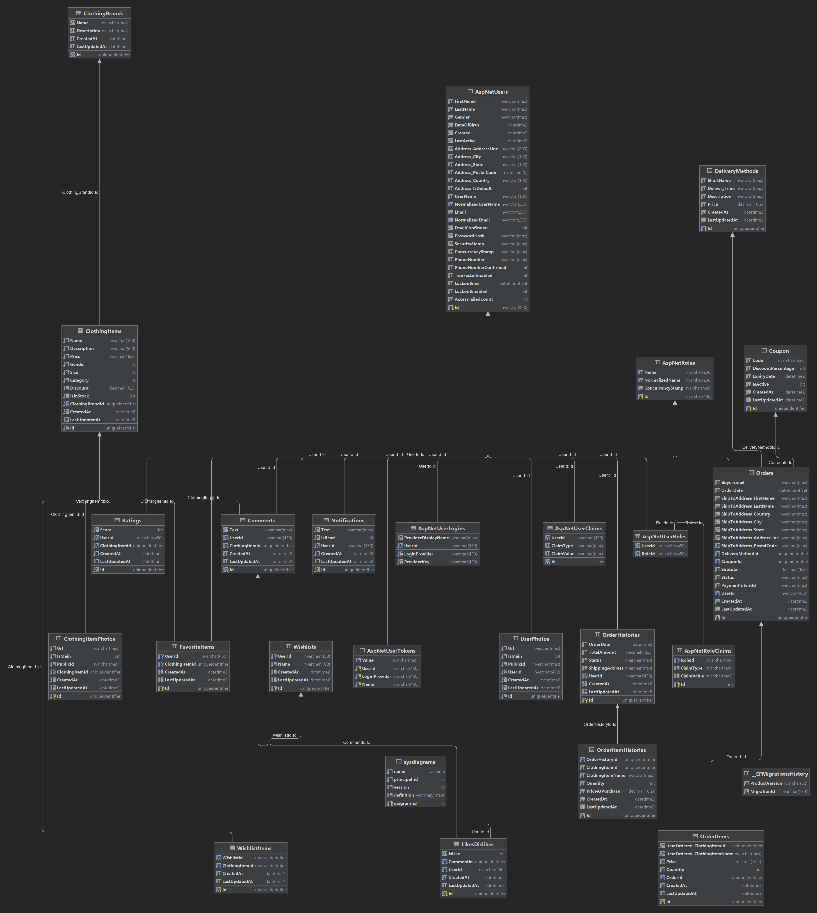

# FashionClothesAndTrends


FashionClothesAndTrends is a comprehensive web application designed to help users discover, purchase, and manage the latest fashion trends. The application offers a wide range of features including browsing clothing items, managing wishlists, applying discount coupons, user authentication, and much more.

## Features

- **User Authentication and Authorization**: Secure login and registration.
- **Clothing Items Management**: Browse, search, and manage clothing items.
- **Wishlist Management**: Add items to wishlist and manage them.
- **Comments and Reviews**: Add and view comments on clothing items.
- **Favorites**: Mark clothing items as favorites and manage them.
- **Likes and Dislikes**: Like or dislike comments.
- **Order Management**: Create and manage orders.
- **Order History**: View order history.
- **Payments**: Handle payments and payment intents.
- **Notifications**: Notify users about discounts on wishlist items.
- **Photo Management**: Upload and manage photos for clothing items.
- **Ratings**: Rate clothing items.
- **Comprehensive Monitoring**: Integrated Prometheus and Grafana for detailed application and infrastructure monitoring.
- **Centralized Logging**: Utilizes Elasticsearch and Kibana for centralized logging and analysis.

## Technology Stack

1. Backend Architecture: The backend of our application is structured using a Clean Architecture, ensuring a clean separation of concerns and a maintainable codebase.
2. Frontend Framework: Angular, a robust platform for building web applications, is used for the frontend. It allows us to structure our codebase in a modular and maintainable manner.
3. UI Components: For the user interface, we have chosen Angular Material. It's a UI component library that adheres to Material Design principles and offers a wide array of ready-to-use components.
4. Caching: Redis, an open-source in-memory data structure store, is used for caching. It serves as a database, cache, and message broker.

- ASP.NET Core 8: A framework for building web applications and APIs.
- Entity Framework Core 8: An ORM for working with relational databases.
- RESTful API: An architectural style for creating APIs.
- Relational Database: SQL Server: A relational database for data storage.
- Distributed Cache: Redis: A distributed cache for improving performance and scalability.
- Clean Architecture: An architectural approach that ensures separation of concerns and framework independence.
- S.O.L.I.D. Principles: Object-oriented design principles for creating flexible and maintainable systems.
- Unit of Work and Repository Pattern: Patterns for managing transactions and abstracting data access.
- AutoMapper: A library for automatic object mapping.
- SignalR: A library for adding real-time functionality such as notifications.
- Client-side: Angular with Angular Material: A framework and UI component library for building client-side applications.
- Docker: Containerization platform for consistent deployment across environments.
- Elasticsearch and Kibana: Centralized logging and analytics.
- Prometheus: Monitoring and alerting.
- Grafana: Data visualization and dashboards.

## Infrastructure

The application is designed to be containerized using Docker, enabling easy deployment and scaling. The following services are included in the Docker Compose configuration:

*   **webapi**: The ASP.NET Core Web API application.
*   **redis**: Redis cache for improving performance.
*   **sql**: SQL Server database for persistent data storage.
*   **elasticsearch**: Elasticsearch for logging and searching.
*   **kibana**: Kibana for visualizing Elasticsearch data.
*   **prometheus**: Prometheus for monitoring application metrics.
*   **grafana**: Grafana for creating dashboards and visualizing metrics.

## Docker Compose Configuration

The `docker-compose.yml` file defines the services, networks, and volumes required to run the application. Key aspects of the configuration include:

*   **Networks**: A bridge network (`app_network`) is used to enable communication between the containers.
*   **Volumes**: Persistent volumes are used for storing data for SQL Server, Redis, Elasticsearch, Prometheus, and Grafana.
*   **Environment Variables**: Environment variables are used to configure the services, including database passwords, Redis passwords, and other settings.
*   **Health Checks**: Health checks are defined for each service to ensure that they are running correctly.
*   **Monitoring**: Prometheus and Grafana are configured to monitor the application's performance and health.
*   **Logging**: Elasticsearch and Kibana are used for centralized logging and analysis.

## Running the Application

To run this project, you need to create an appsettings.json file in the WebAPI section with the following structure:

```
{
  "ApplicationInsights": {
    "ConnectionString": "Your-Connection-String"
  },
  "RateLimiting": {
    "PermitLimit": 100,
    "Window": 60,
    "ReplenishmentPeriod": 1
  },
  "Cache": {
    "DefaultExpirationMinutes": 60,
    "AbsoluteExpirationMinutes": 1440
  },
  "Security": {
    "LockoutSettings": {
      "MaxFailedAttempts": 5,
      "LockoutMinutes": 15
    },
    "PasswordSettings": {
      "RequireDigit": true,
      "RequireLowercase": true,
      "RequireNonAlphanumeric": true,
      "RequireUppercase": true,
      "RequiredLength": 8
    }
  },
  "Serilog": {
    "MinimumLevel": {
      "Default": "Information",
      "Override": {
        "Microsoft": "Warning",
        "Microsoft.Hosting.Lifetime": "Information",
        "Microsoft.EntityFrameworkCore": "Warning",
        "Microsoft.AspNetCore.Authentication": "Information"
      }
    },
    "WriteTo": [
      {
        "Name": "Console",
        "Args": {
          "outputTemplate": "[{Timestamp:HH:mm:ss} {Level:u3}] {Message:lj}{NewLine}{Exception}"
        }
      },
      {
        "Name": "File",
        "Args": {
          "path": "/logs/log-.txt",
          "rollingInterval": "Day",
          "outputTemplate": "{Timestamp:yyyy-MM-dd HH:mm:ss.fff zzz} [{Level:u3}] {Message:lj}{NewLine}{Exception}"
        }
      }
    ],
    "Enrich": ["FromLogContext", "WithMachineName", "WithThreadId", "WithProcessId"]
  },
  "AllowedHosts": "*",
  "ConnectionStrings": {
    "DefaultDockerDbConnection": "Server=sql_server2022,1433;Database=FashionClothesAndTrendsDB;User Id=sa;Password=MyPass@word90_;MultipleActiveResultSets=true;TrustServerCertificate=True",
    "DefaultLocalDbConnection": "Server=(localdb)\\MSSQLLocalDB;Database=FashionClothesAndTrendsDB;MultipleActiveResultSets=true",
    "Redis": "redis:6379,password=MyPass@word90_,abortConnect=false",
    "RedisLocalDb": "localhost:6379,abortConnect=false"
  },
  "Token": {
    "Key": "<......>",
    "Issuer": "https://localhost:5001",
    "Audience": "https://localhost:5001"
  },
  "CloudinarySettings": {
    "CloudName": "<.....>",
    "ApiKey": "<.....>",
    "ApiSecret": "<.....>"
  },
  "StripeSettings": {
    "PublishableKey": "<.....>",
    "SecretKey": "<.....>",
    "WhSecret": "<.....>"
  },
  "Kestrel": {
    "Endpoints": {
      "Https": {
        "Url": "https://+:443",
        "Certificate": {
          "Path": "/https/localhost.pfx",
          "Password": "MyPass@word90_"
        }
      }
    }
  }
}
```
Replace "<Example>" with your actual data respectively.

## Configuration
### Running the Application Fully in Docker

1. For running ASP.NET core with HTTPS inside of docker, you need to generate a self-signed certificate. You can do this by running the following command in your terminal:
```bash
openssl req -x509 -newkey rsa:2048 -keyout key.pem -out cert.pem -days 365 -nodes -subj '/CN=localhost'
```
2. Then need converts the key and certificate to a .pfx file:
```bash
openssl pkcs12 -export -out localhost.pfx -inkey key.pem -in cert.pem -password pass:MyPass@word90_
```
3. After that, you need to copy the generated localhost.pfx file to the FashionClothesAndTrends.WebAPI/certs folder.
4. Run the application using Docker by executing the following command in your terminal:
To ensure a clean rebuild of your images.
```bash
docker-compose build --no-cache
```
To start the application using the newly built images.
```bash
docker-compose up --build
```
This will start all the services, including SQL Server and Redis, in Docker containers.


## For Administrator Privileges
Email: admin@example.com

Password: Pa$$w0rd

## Database Diagram


## Screenshots


## Contributing

Contributions are welcome. Please fork the repository and create a pull request with your changes.

## Author

Bohdan Harabadzhyu

## License

[MIT](https://choosealicense.com/licenses/mit/)

## YouTube Review
<details>
<summary>📺 Watch Video Review</summary>

[](https://www.youtube.com/watch?v=uSBj_Nvddto)
</details>
